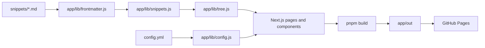

# Agent Guide

## Directory Tree

```text
./                     # repo root
├── .github/           # GitHub automation
│   └── workflows/     # CI and Pages deploy
├── .githooks/         # shared git hooks
│   ├── hooks/         # Git hook wrappers
│   ├── pre-commit/    # commit checks
│   └── pre-push/      # push checks
├── app/               # Next.js static site
│   ├── app/           # route shell and global CSS
│   ├── components/    # reusable UI
│   ├── lib/           # config, frontmatter, snippet, tree, output helpers
│   ├── public/        # static assets
│   ├── scripts/       # OKF index generator and conformance check
│   └── tests/         # Playwright specs
├── docs/              # requirements and work notes
│   └── screenshots/   # visual evidence
└── snippets/          # OKF rule bundle; see snippets/AGENTS.md
```

## Runtime Flow



## AGENTS.md Rules

- Every `AGENTS.md` must include a commented directory tree for its subtree.
- Stop a tree at any child dir with its own `AGENTS.md`; child file owns that subtree.
- Every dir with `AGENTS.md` must also hold `CLAUDE.md` as a symlink to it.
- Create symlink with `ln -s AGENTS.md CLAUDE.md`; commit link, never copy.
- Keep each `AGENTS.md` under 250 lines.
- If an `AGENTS.md` grows past 250 lines, move local detail into child `AGENTS.md`.
- Every `AGENTS.md` must include at least one Mermaid diagram.
- Mermaid diagrams must show flow, state, pipeline, or runtime interaction.
- Do not redraw the folder layout in Mermaid.
- Refresh relevant `AGENTS.md` after about 1000 changed LOC below its dir.

## Code Quality

- Enforce rules by machine wherever possible.
- Use git hooks for fast local checks when adding enforceable rules.
- Use CI as PR backstop.
- Keep package, build, test, lint, and secret-scan config in purpose dirs.
- Product code config belongs in `app/`, `web/`, or `packages/<name>/`.
- Repo tooling config belongs in `tools/<name>/`.
- Keep root free of package manager, compiler, test, and lint config when feasible.
- Every language must have linter and auto-formatter coverage, including Markdown.
- No hand-written file may exceed 600 lines.
- Generated and vendored files are exempt from file length limits.
- Keep hand-written lines to 100 chars.
- Generated files, vendored files, URLs, and hashes are exempt from line length limits.
- Use strict lint config. Treat warnings as errors.
- Do not disable or downgrade rules to pass checks.
- Inline suppressions need exact rule code and reason.

## Git Commits

- Each commit must contain one logical change.
- Do not mix unrelated edits, refactors with behavior changes, or formatting with logic.
- Every commit must be independently checkable and green.
- Use Conventional Commits: `type(scope?): subject`.
- Allowed types: `feat`, `fix`, `docs`, `refactor`, `test`, `perf`, `build`,
  `ci`, `chore`, `style`, `revert`.
- Subject uses imperative mood, about 50 chars, no period.
- Non-trivial commits need body sections: `Context`, `Change`, `Rationale`,
  `Impact/Risk`, `Tests`.
- Body explains what and why, wraps near 72 chars.
- Use `Fixes #123` or `Refs #123` footer when issue exists.
- If no issue exists, body must clearly state why.
- Do not add AI attribution trailers.
- Forbidden trailers: `Co-authored-by`, `Generated-by`, `AI-Generated-by`,
  `Assisted-by`, `Model`.
- Allowed trailers: `Fixes`, `Refs`, `BREAKING CHANGE`, human `Signed-off-by`.

## Git Workflow

- Commit in small meaningful increments.
- Do not push vague or `WIP` commits.
- Keep scratch checkpoints local until green and reviewable.
- Rebase or squash local noise before PR or merge.
- Use shared hooks with `git config core.hooksPath .githooks/hooks`.
- Hook wrappers execute executable scripts in matching `.githooks/<hook>/` dirs.
- Run relevant tests before each commit.
- Minimum check is fast suite or targeted tests for changed area.
- Shared branches must not contain failing commits.

## Project Docs

- Track tasks as Markdown files under `docs/backlog/`.
- Use `docs/backlog/open/` for work awaiting implementation.
- Use `docs/backlog/pending-review/` for completed work awaiting review.
- Use `docs/backlog/done/` for completed and reviewed work.
- Name task files `<index>_<task-slug>.md`.
- Use `docs/todo.md` for lightweight status.
- Use `- [ ]` open, `- [~]` in progress, `- [x]` done.
- Track troubleshooting in `docs/troubleshooting/<DATE>_<SUBJECT>.md`.
- Append each troubleshooting step to the case file while investigating.

## Writing

- Maximize info density while keeping text easy to read.
- Use headings without numbering.
- Avoid bold text unless info is critical.
- Do not use emojis.
- Use tags such as `[ERROR]`, `[WARNING]`, or `[INFO]` when markers help.
- Abbreviate common prose words when clarity holds: DB, auth, config, req, res,
  fn, impl.
- Drop articles, filler, pleasantries, and hedging.
- Keep code symbols, function names, API names, and error strings verbatim.
- Prefer short words. Sentence fragments are fine.

## Local Checks

- Install deps: `cd app && pnpm install --frozen-lockfile`.
- OKF conformance: `cd app && pnpm check:okf`.
- Regenerate bundle indexes: `cd app && pnpm snippets:index`.
- Lint: `cd app && pnpm lint`.
- Unit tests: `cd app && pnpm test`.
- E2E tests: `cd app && pnpm test:e2e`.
- Build: `cd app && pnpm build`.
