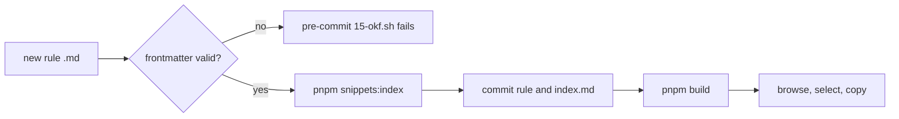

# Snippets Bundle Guide

This tree is an OKF v0.2 knowledge bundle. Each concept document is one reusable rule that
users select and copy into an `AGENTS.md` or `CLAUDE.md`.

Spec: <https://github.com/GoogleCloudPlatform/knowledge-catalog/blob/main/okf/SPEC.md>

## Directory Tree

```text
snippets/              # OKF bundle root, declares okf_version in index.md
├── code/              # source code rules
│   ├── powershell/    # PowerShell style
│   ├── quality/       # lint, size, config placement
│   └── scripts/       # script logging and reliability
├── docs/              # documentation workflow rules
│   ├── agents-md/     # AGENTS.md structure
│   └── project-docs/  # backlog, todo, troubleshooting
├── git/               # version control rules
│   ├── commits/       # message format and atomicity
│   └── workflow/      # branching, hooks, quality gates
├── knowledge/         # knowledge base rules
│   └── okf/           # the OKF format itself
├── platform/          # platform specific rules
│   └── intune/        # Intune Win32 packaging
├── standards/         # cross-cutting conventions
│   ├── datetime/      # date, time, and timestamp format
│   ├── identifiers/   # code lists for places, languages, ids
│   └── versioning/    # release version numbering
└── writing/           # prose style and density rules
```

## Authoring Flow



## Rules

- Every concept document needs YAML frontmatter with a non-empty `type`.
- Use `Rule` for a prescriptive rule, `Playbook` for a procedure, `Reference` for source material.
- Add `title` and `description`; the browser and the generated indexes read both.
- Add `tags` for cross-cutting grouping, and `status` when a rule is not `stable`.
- Record `generated: { by, at }` with the actor convention: `human:<id>` for hand-authored rules.
- Add `sources` only when a rule genuinely derives from an external document.
- `index.md` and `log.md` are reserved. Never write a rule into either name.
- Regenerate indexes with `pnpm snippets:index` after adding, renaming, or moving a rule.
- Validate with `pnpm check:okf`; the pre-commit hook runs it.
- Keep one rule per file. Split unrelated guidance into separate concepts.
- Category is the directory path, so nest a new group rather than prefixing a folder name.
