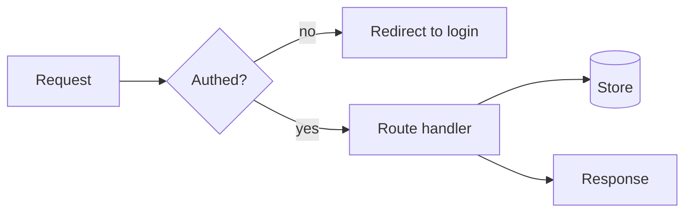

Every `AGENTS.md` MUST include at least one Mermaid diagram that explains what the directory layout alone cannot: control and data flow, request/build/deploy pipelines, state machines, or how modules interact at runtime. Use it to make the non-obvious legible at a glance — do not just redraw the file tree. Wrap it in a ```mermaid block so it renders on GitHub, and keep it current as the behavior it describes changes.


