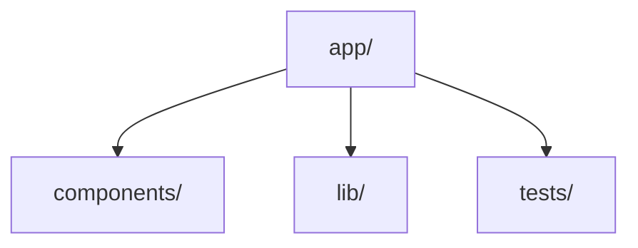

Every `AGENTS.md` MUST contain a Mermaid graph of its directory: immediate subdirectories and key files as nodes, important relationships as edges. Wrap it in a ```mermaid block so it renders on GitHub, and update the graph whenever the structure it describes changes.


