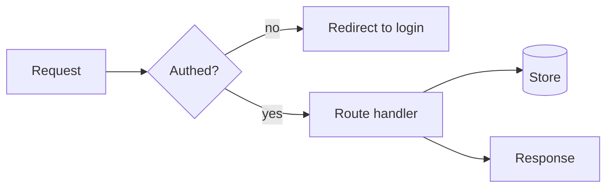

Every `AGENTS.md` MUST include at least one Mermaid diagram. Show what the file tree cannot: control and data flow, build and deploy pipelines, state machines, runtime module interaction. Make the non-obvious clear at a glance. Do not redraw the folder layout. Wrap it in a ```mermaid block so it renders. Keep it current as the behavior changes.


